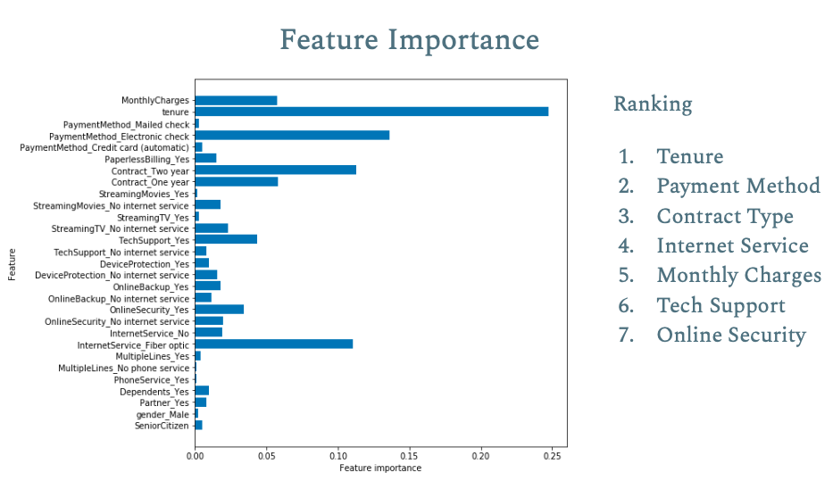

# Verizon Churn Data

## Goal:
Use Exploratory Data Analysis to understand why customers are leaving Verizon wireless and use Models to predict if a customer will Churn or not. 

## Table of Contents:
1) [Slides](https://docs.google.com/presentation/d/19bnUM1EkHwUEDW_ZzACzdOhHTG40WMaFLT11wK3Z-04/edit?usp=sharing)
2) Modeling Repository has code for my modeling results.

## Process:
1) EDA done using Tableau
2) Modeling done with with aid of Python, Pandas, Numpy, Sklearn and XGB.

## Modeling Results:
Logistic Regression, RandomForestClassifier and XGBoostClassifier were all used due their nature of predicting binary targets. 
* Logistic Regression: Accuracy 79.95%
* RandomForestClassifier: Accuracy 78.31%
* XGBoostClassifier: Accuracy 79.16%

### Charts:
Chart Below Ranks Feature Importance

### Conclusion/Actionable Insight:
Check Slide 20 in [Slides](https://docs.google.com/presentation/d/19bnUM1EkHwUEDW_ZzACzdOhHTG40WMaFLT11wK3Z-04/edit?usp=sharing).

